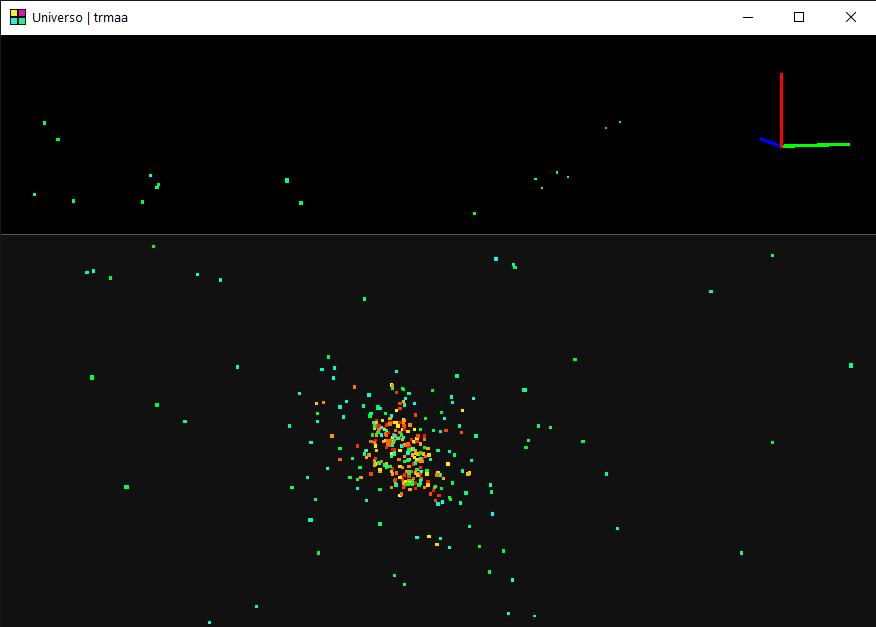

# PARTICLE LIFE 3D ENGINE, 

It still in development: todo -> AI model, flexible phisic relationships, dynamic way to create particles, dynamic way to render in order...

## How to use

On Bash: `chmod +x compile.sh` and `./compile.sh` or java `java -jar Universo.jar`. On Bach: `compile.bat` or `java -jar Universo.jar`.

